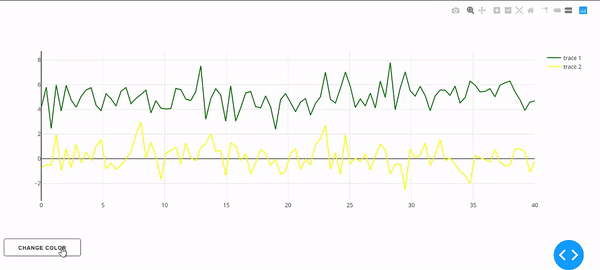

# Custom Dash Component - update data in dcc.Graph
This is a library to update multiples traces in a dcc.Graph using dash plotly in python. This code is based from the "mydcc.Change_trace", repo: https://github.com/jimmybow/mydcc. The idea is to update a trace or a list of traces in a callback without the need of re-draw the figure (you don't need a layout component).<br/> <br/>

**Multiple callbacks with the same output**: This custom component allow you to update the data in the same graph using multiple callbacks (you can't have the same output in two callbacks with dash). 

## Installation: 
    1. installing:
    ```
    $ pip install dash_update_data_components
    ```
## Requirements:
* **dash** -- The core dash backend
* **dash-renderer** -- The dash front-end
* **dash-html-components** -- HTML components
* **dash-core-components** -- Supercharged components
* **plotly** -- Plotly graphing library used in examples

## Update Trace:
Update data in a dcc.Graph. Return a list of dictionaries:
```
@app.callback(...)
def func():
    return [dict(x = data1,y = data1),dict(x = data2,y = data2),...]
```
Code:
```
import dash_update_data_components

app.layout = html.Div([
    html.Div(children=[
        dcc.Graph(
              id='mainGraph',
              figure={
                  'data': data,
                  'layout': layout          
        )
    ]),

    dash_update_data_components.EditableGraph(id = 'ii', aim = 'mainGraph'),
])

@app.callback(dash.dependencies.Output(component_id='ii', component_property='data'),             
             [dash.dependencies.Input(component_id='mainGraph', component_property='figure')])
def update_graph(fig):
    if fig is not None:        
        data = dict(x = fig['data'][0]['x']+20,
                    y = fig['data'][0]['y']-20,
                    opacity = 1
                    )

        return [data]
    else:
        raise PreventUpdate

if __name__ == '__main__':
    app.run_server(debug=True)
```

## Same Output in multiple callbacks:
Update data in a dcc.Graph from multiple callbacks with the same output.
```
import dash_update_data_components

app.layout = html.Div([
    html.Div(children=[
        dcc.Graph(
              id='mainGraph',
              figure={
                  'data': data,
                  'layout': layout          
        )
    ]),

    dash_update_data_components.EditableGraph(id = 'ed1', aim = 'mainGraph'),
    dash_update_data_components.EditableGraph(id = 'ed2', aim = 'mainGraph'),
    dash_update_data_components.EditableGraph(id = 'ed3', aim = 'mainGraph')
])

@app.callback(dash.dependencies.Output(component_id='ed1', component_property='data'),             
             [dash.dependencies.Input(component_id='mainGraph', component_property='figure')])
def update_graph(fig):
    if fig is not None:        
        data = dict(x = fig['data'][0]['x']+20,
                    y = fig['data'][0]['y']-20,
                    opacity = 1
                    )

        return [data]
    else:
        raise PreventUpdate
        
@app.callback(dash.dependencies.Output(component_id='ed2', component_property='data'),             
             [dash.dependencies.Input(component_id='mainGraph', component_property='figure')])
def update_graph(fig):
    if fig is not None:        
        data = dict(x = fig['data'][0]['x']+10,
                    y = fig['data'][0]['y']-10,
                    opacity = 2
                    )

        return [data]
    else:
        raise PreventUpdate
        
        
        
@app.callback(dash.dependencies.Output(component_id='ed3', component_property='data'),             
             [dash.dependencies.Input(component_id='mainGraph', component_property='figure')])
def update_graph(fig):
    if fig is not None:        
        data = dict(x = fig['data'][0]['x']+5,
                    y = fig['data'][0]['y']-5,
                    opacity = 3
                    )

        return [data]
    else:
        raise PreventUpdate

if __name__ == '__main__':
    app.run_server(debug=True)
```


## Test:
This is an example code to alternate the colour in two traces by pressing a button in dash.
    1.  Run the `usage.py` sample dash app:
        ```
        $ python usage.py
        ```

<br>

